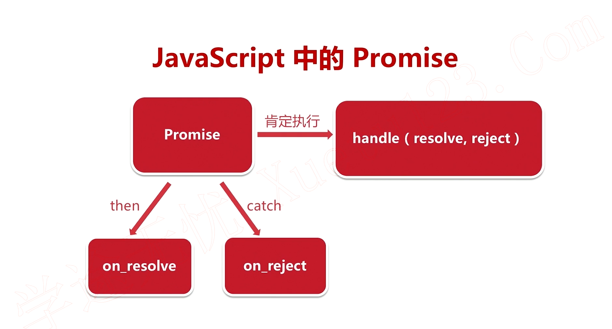
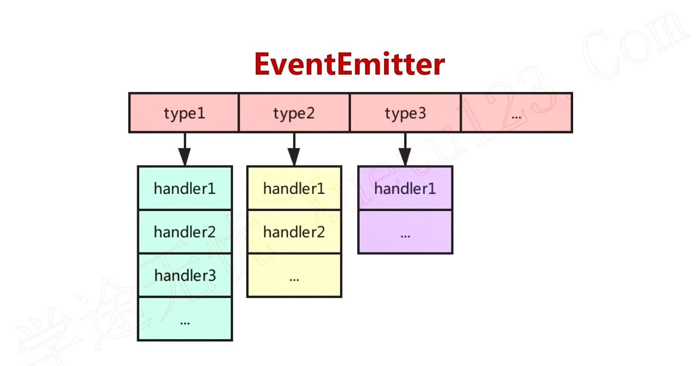

# 变量与类型
对比项|js|C语言
--|:--:|--:
定义变量|var a; let a|int a;
布尔|true, false|1, 0
字符串|str = 'hello world'|char *str = "hello world"
数组|var arr = [1, 5.1, 'hw']|int arr[] = {1, 5, 6}
空|null, undefined| NULL, 0

1. var是全局变量，let是局部变量
2. js是弱类型，所以数组中可以放不同的类型
3. null是空对象，undefined是变量定义没有初始化

# 基本运算
对比项|js|C语言
--|:--:|--:
算数运算|+,-,*,/,%|+,-,*,/,%
比较运算|>,<,!=,==,===|>,<,!=,==,===
逻辑运算|&&,||,!|&&,||,!

1. js中===是严格比较（要求类型也一样才相等）例如null==undefined是true，null===undefined是false

# 流程控制
对比项|js|C语言
--|:--:|--:
分支语句|if/switch|if/switch
循环语句|for,for...in/of arr,while|for,for auto : arr,while
函数|function func(...){...return ret;}|int func(...){...return ret;}
匿名函数|()=>{...}| {...}

1. if/switchjs和C++是一模一样的
2. js中的for in是得到数组元素的索引，for of是得到数组元素的值
3. js匿名函数类似于C++11的lambda表达式

# 高级语法
类|js|C语言
--|:--:|--:
定义|class|class
构造/析构|structor/没有|类名()/~类名()
私有成员/方法|_xxx|private: xxx

1. js没有声明类成员和方法的地方，所以定义和初始化都放在structor
2. 数组扩展符 '...'
    定义了一个数组var arr = [1,2,3],则...a表示1,2,3 (也就是将arr展开放在这里)
3. 导出模块 export.modules
    编写好一个模块可以用export.modules将其到处供其它模块使用，类似C语言中的库

# Promise和EventEmitter

## Promise

1. handle是肯定执行的逻辑，例如handle中执行发送http请求
2. resolve是handle成功后执行的逻辑，例如http请求返回200
3. reject是handle失败后的执行逻辑，例如http请求404等

C++实现可以参考[这里](https://github.com/xhawk18/promise-cpp)

## EventEmitter

观察者模式，订阅者可以注册不同type的handler，观察者通过emit通知所有订阅者

C++实现可以参考[这里](https://gist.github.com/martinfinke/a636dcddbcf112344b59)