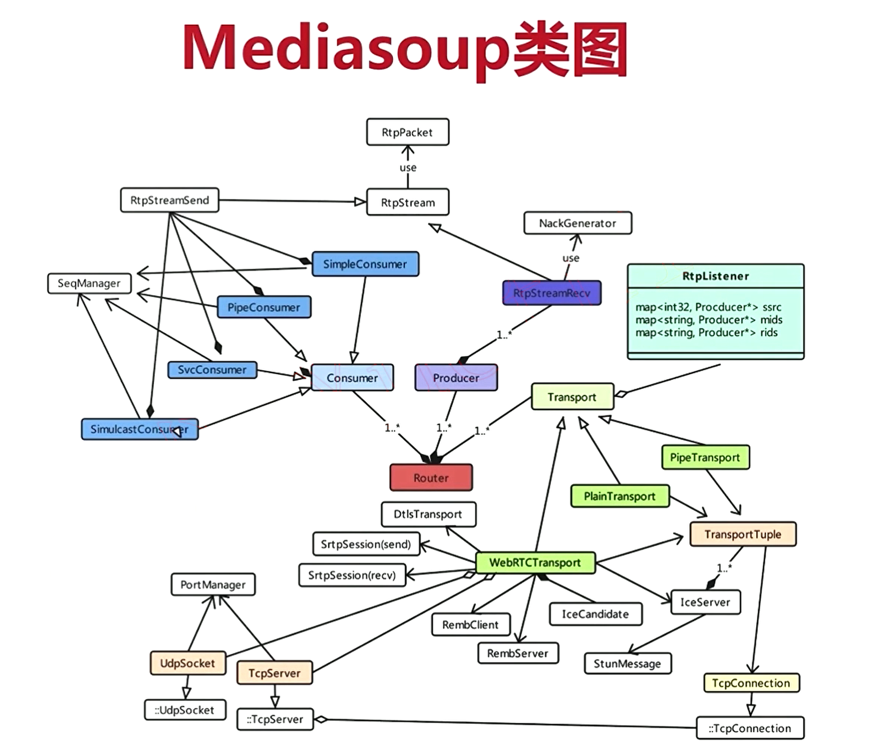

关于Router、Transport、Consumer等概念和mediasoup js中介绍的都是类似的。

Router相当于一个路由，房间的概念，一个Router中管理着所有的Transport、Producer、Consumer。

Consumer音视频消费者，mediasoup会将音视频数据发送给消费者，消费者发送到对应的客户端。其中SimpleConsumer是普通的rtp音视频消费者，发送标准RTP格式的音视频数据；PipeConsumer是管道音视频消费者，用户worker和worker之间传输音视频数据；SvcConsumer是分层音视频消费者，详细可以了解下SVC的原理；SimulcastConsumer是Simulcast音视频消费者，是指发布多路不同分辨率的视频流，客户端可以按需订阅。Consumer使用RtpStreamSend发送rtp数据流，Consumer为什么需要发送rtp数据流？需要跳出mediasoup来看，在mediasoup中它作为音视频消费者，接收来自Producer的音视频数据；在整个多人视频场景下，Consumer需要将音视频数据发送给相应的客户端。RtpStreamSend基于RtpStream。

SeqManager用来管理rtp排序，Consumer收到Producer的数据以后需要排序后发送给客户端，SeqManager就是通过rtp序列号来管理rtp数据包的排序。

Producer音视频生产者，mediasoup会从生产者接收音视频数据，生产者的数据来源于对应的客户端。Producer使用RtpStreamRecv接收来自客户端的数据，RtpStreamRecv基于RtpStream。RtpStreamRecv接收客户端数据的时候，可能会发生丢包，所以使用NackGenerator来生成需要重传的包，并通知客户端。具体可以去了解Nack原理。

RtpStream封装了rtp收发相关的操作。RtpStream中使用RtpPacket来解析rtp协议。

Transport用来传输音视频数据，Producer、Consumer的数据传输是建立在Transport基础上的。Transport包括三种类型：PipeTransport用于work和work之间的音视频传输；PlainTransport用于普通未加密的rtp流的传输（例如通过ffmpeg直接rtp推流）；WebRtcTransport传输用于webrtc流的传输；

WebRtcTransport传输用于webrtc流的传输；在所有Transport中最为复杂，包含加密、ice协商等。其中RemClient/RemServer用来带宽评估；IceServer用来协商ice；IceCandidate管理ice候选地址；UdpSocket/TcpServer用来实际的音视频传输；DtlsTransport/SrtpSession用来管理dtls和srtp加密；TransportTupley用来保存实际的一条传输相关的信息，包括两端的ip、端口、传输类型（udp/tcp）等。
