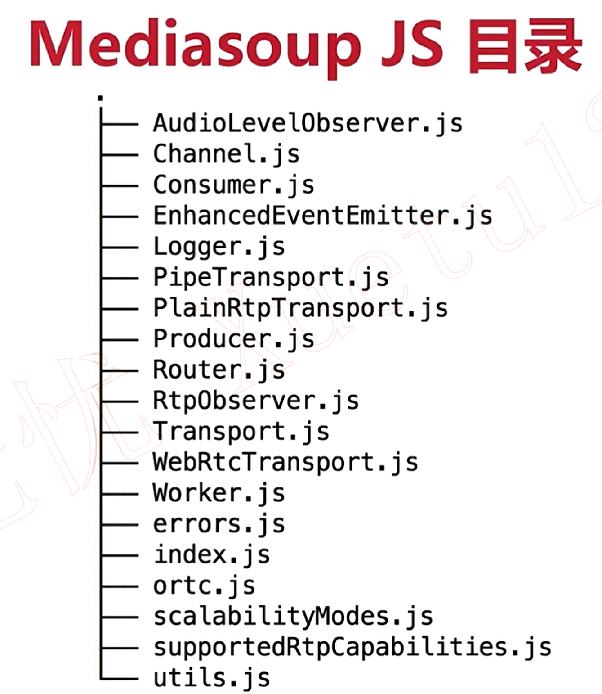
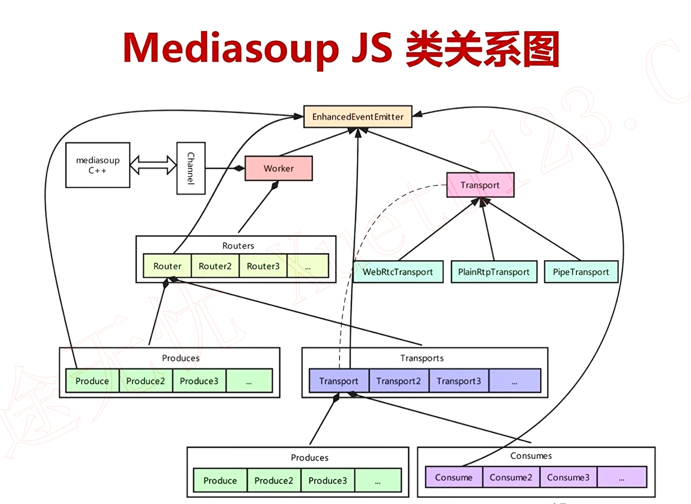

# js相关文件
先看下mediasoup js部分的相关文件：


看几个比较重要的文件：
1. AudioLevelObserver.ts
    
    音频音量观察者，C++层会抛出音频音量相关通知，js层会在此文件中处理
2. Channel.ts
    
    用户js和C++层通信的类（基于管道通信）
3. Consumer.ts
    
    音频/视频消费者，mediasoup会将音视频数据发送给消费者，消费者发送到对应的客户端
4. EnhancedEventEmitter.ts
    
    EventEmitter的封装，将C++层的事件一层一层向上抛，感兴趣的模块可以注册相关的事件来获取通知
5. PipeTransport.ts
    
    音视频传输通道，PipeTransport传输用于work和work之间的音视频传输
6. PlainTransport.ts
    
    音视频传输通道，PlainTransport传输用于普通未加密的rtp流的传输（例如通过ffmpeg直接rtp推流）
7. Producer.ts
    
    音频/视频生产者，mediasoup会从生产者接收音视频数据，生产者的数据来源于对应的客户端
8. Router.ts
    
    路由，类似于一个房间，管理多个Transport、Producer、Consumer
9. RtpObserver.ts
    
    rtp观察者
10. Transport.ts
    
    传输基类，pipe传输，rtp传输等均继承该类
11. WebRtcTransport.ts
    
    音视频传输通道，WebRtcTransport传输用于webrtc流（加密的）的传输
12. Worker.ts
    
    一个Worker是一个进程，其中管理多个Router

# js相关类图


Worker通过Channel和mediasoup C++进行通信，一个Worker管理多个Router，每个Router管理多个Transport，每个Transport中有多个Producer和Consumer，Router中的Producers
中包含整个Router中所有的Producer（每个Transport中的Producer）

EnhancedEventEmitter会抛出C++层的事件，其中Worker、Router、Transport、Consumer等都注册了事件监听。

# mediasoup js的作用
1. 起到管理的作用
2. 生产json字符串传递到C++层

例如js中的
```
await this._channel.request('worker.createRouter', internal);
```
会向C++层发送创建Router的请求，参数保存在json中，对应C++层，会创建一个Router
```
auto* router = new RTC::Router(routerId);
```