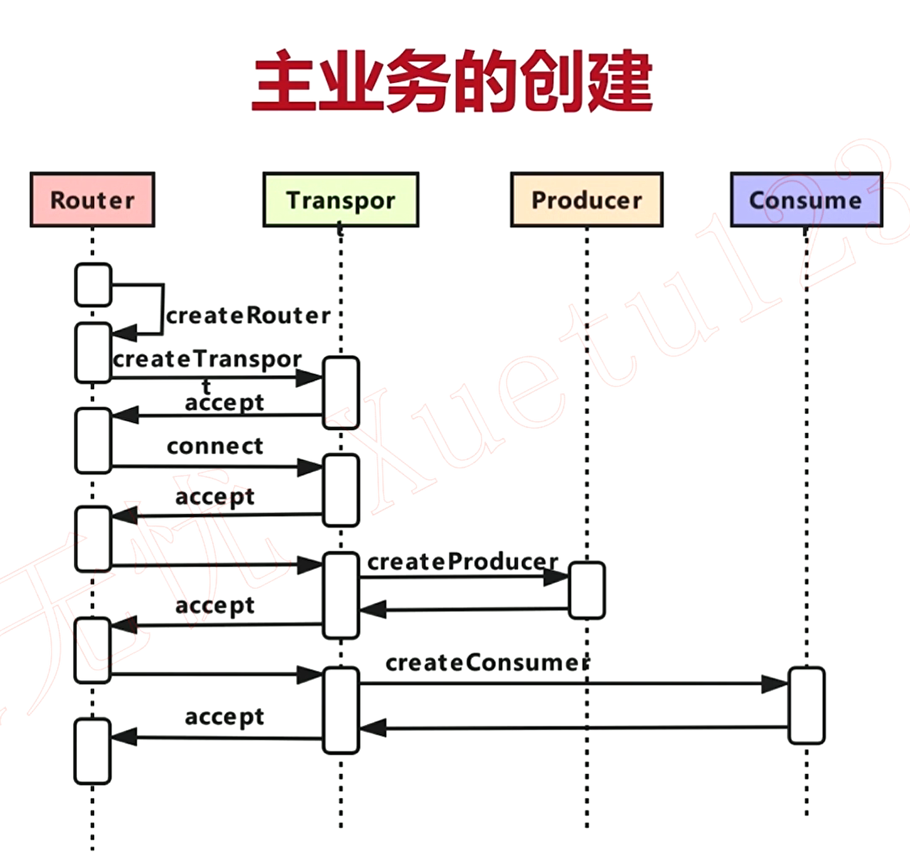

# 主业务流程
先来张图：


如图所示，在一个视频会议场景中，mediasoup的主要业务流程分为如下几步，上图中的每一步流程都是由mediasoup js端发送request给mediasoup C++端来触发的：
1. createRouter --> Channel::Request::MethodId::WORKER_CREATE_ROUTER
2. createTransport --> Channel::Request::MethodId::ROUTER_CREATE_WEBRTC_TRANSPORT
3. connect --> Channel::Request::MethodId::TRANSPORT_CONNECT
4. createProducer --> Channel::Request::MethodId::TRANSPORT_PRODUCE
5. createConsumer --> Channel::Request::MethodId::TRANSPORT_CONSUME

# createRouter
WORKER_CREATE_ROUTER请求是在worker.cpp中处理的：
```
case Channel::Request::MethodId::WORKER_CREATE_ROUTER:
{
	std::string routerId;

	// routerId是由js层传过来，从json中获取routerId
    // routerId保存在request中的internal json对象中
	SetNewRouterIdFromRequest(request, routerId);
    // 创建Router
	auto* router = new RTC::Router(routerId);
    // 保存Router
	this->mapRouters[routerId] = router;

	MS_DEBUG_DEV("Router created [routerId:%s]", routerId.c_str());
    // 向js端发送确认
	request->Accept();

	break;
}
```
mediasoup js端发送WORKER_CREATE_ROUTER请求时，发送的一些public参数（不包含internal）可以在[mediasoup官网](https://mediasoup.org/documentation/v3/mediasoup/api/#worker-createRouter)查看。

# createTransport
ROUTER_CREATE_WEBRTC_TRANSPORT请求是在Router.cpp中处理的（transport分为很多种，其中webrtc transport最为复杂，所以我们以webrtc transport为代表分析）：
```
case Channel::Request::MethodId::ROUTER_CREATE_WEBRTC_TRANSPORT:
{
	std::string transportId;

	// transportId是由js层传过来，从json中获取transportId
    // transportId保存在request中的internal json对象中
	SetNewTransportIdFromRequest(request, transportId);

	// 使用transportId和json data参数来创建WebRtcTransport
	auto* webRtcTransport = new RTC::WebRtcTransport(transportId, this, request->data);

	// 保存webRtcTransport
	this->mapTransports[transportId] = webRtcTransport;

	MS_DEBUG_DEV("WebRtcTransport created [transportId:%s]", transportId.c_str());

    // 构造返回参数
	json data = json::object();
	webRtcTransport->FillJson(data);

	request->Accept(data);

	break;
}
```
mediasoup js端发送ROUTER_CREATE_WEBRTC_TRANSPORT请求时，发送的一些public参数（不包含internal）可以在[mediasoup官网](https://mediasoup.org/documentation/v3/mediasoup/api/#WebRtcTransportOptions)查看。


WebRtcTransport构造函数首先解析json参数，然后创建IceServer（随机生成user和pasword）和DtlsTransport：
```
...
// Create a ICE server.
this->iceServer = new RTC::IceServer(
	this, Utils::Crypto::GetRandomString(16), Utils::Crypto::GetRandomString(32));

// Create a DTLS transport.
this->dtlsTransport = new RTC::DtlsTransport(this);
```

ROUTER_CREATE_WEBRTC_TRANSPORT处理中，会构造返回参数返回给js端，参数中包含构造IceServer时的用户名和密码（用于后续身份认证）、dtls参数、iceCandidates等：
```
void WebRtcTransport::FillJson(json& jsonObject) const
{
    MS_TRACE();

	// Call the parent method.
	RTC::Transport::FillJson(jsonObject);

	// Add iceRole (we are always "controlled").
	jsonObject["iceRole"] = "controlled";

	// Add iceParameters.
	jsonObject["iceParameters"] = json::object();
	auto jsonIceParametersIt    = jsonObject.find("iceParameters");

	(*jsonIceParametersIt)["usernameFragment"] = this->iceServer->GetUsernameFragment();
	(*jsonIceParametersIt)["password"]         = this->iceServer->GetPassword();
	(*jsonIceParametersIt)["iceLite"]          = true;

	// Add iceCandidates.
	jsonObject["iceCandidates"] = json::array();
	auto jsonIceCandidatesIt    = jsonObject.find("iceCandidates");

	for (size_t i{ 0 }; i < this->iceCandidates.size(); ++i)
	{
		jsonIceCandidatesIt->emplace_back(json::value_t::object);

		auto& jsonEntry    = (*jsonIceCandidatesIt)[i];
		auto& iceCandidate = this->iceCandidates[i];

		iceCandidate.FillJson(jsonEntry);
	}

	// Add iceState.
	switch (this->iceServer->GetState())
	{
		case RTC::IceServer::IceState::NEW:
			jsonObject["iceState"] = "new";
	    	break;
		case RTC::IceServer::IceState::CONNECTED:
			jsonObject["iceState"] = "connected";
			break;
		case RTC::IceServer::IceState::COMPLETED:
			jsonObject["iceState"] = "completed";
			break;
		case RTC::IceServer::IceState::DISCONNECTED:
			jsonObject["iceState"] = "disconnected";
			break;
	}

	// Add iceSelectedTuple.
	if (this->iceServer->GetSelectedTuple())
		this->iceServer->GetSelectedTuple()->FillJson(jsonObject["iceSelectedTuple"]);

	// Add dtlsParameters.
	jsonObject["dtlsParameters"] = json::object();
	auto jsonDtlsParametersIt    = jsonObject.find("dtlsParameters");

	// Add dtlsParameters.fingerprints.
	(*jsonDtlsParametersIt)["fingerprints"] = json::array();
	auto jsonDtlsParametersFingerprintsIt   = jsonDtlsParametersIt->find("fingerprints");
	auto& fingerprints                      = this->dtlsTransport->GetLocalFingerprints();

	for (size_t i{ 0 }; i < fingerprints.size(); ++i)
	{
		jsonDtlsParametersFingerprintsIt->emplace_back(json::value_t::object);

		auto& jsonEntry   = (*jsonDtlsParametersFingerprintsIt)[i];
		auto& fingerprint = fingerprints[i];

		jsonEntry["algorithm"] =
		  RTC::DtlsTransport::GetFingerprintAlgorithmString(fingerprint.algorithm);
		jsonEntry["value"] = fingerprint.value;
	}

	// Add dtlsParameters.role.
	switch (this->dtlsRole)
	{
		case RTC::DtlsTransport::Role::NONE:
			(*jsonDtlsParametersIt)["role"] = "none";
			break;
		case RTC::DtlsTransport::Role::AUTO:
			(*jsonDtlsParametersIt)["role"] = "auto";
			break;
		case RTC::DtlsTransport::Role::CLIENT:
			(*jsonDtlsParametersIt)["role"] = "client";
			break;
		case RTC::DtlsTransport::Role::SERVER:
			(*jsonDtlsParametersIt)["role"] = "server";
			break;
	}

	// Add dtlsState.
	switch (this->dtlsTransport->GetState())
	{
		case RTC::DtlsTransport::DtlsState::NEW:
			jsonObject["dtlsState"] = "new";
			break;
		case RTC::DtlsTransport::DtlsState::CONNECTING:
			jsonObject["dtlsState"] = "connecting";
			break;
		case RTC::DtlsTransport::DtlsState::CONNECTED:
			jsonObject["dtlsState"] = "connected";
			break;
		case RTC::DtlsTransport::DtlsState::FAILED:
			jsonObject["dtlsState"] = "failed";
			break;
		case RTC::DtlsTransport::DtlsState::CLOSED:
			jsonObject["dtlsState"] = "closed";
			break;
	}
}
```
# connect
TRANSPORT_CONNECT是在WebRtcTransport.cpp中处理的，主要是运行dtls transport：
```
MayRunDtlsTransport();
```

# createProducer
TRANSPORT_PRODUCE是在Transport.cpp中处理的：
```
case Channel::Request::MethodId::TRANSPORT_PRODUCE:
{
	std::string producerId;

	// producerId是由js层传过来，从json中获取producerId
    // producerId保存在request中的internal json对象中
	SetNewProducerIdFromRequest(request, producerId);

	// This may throw.
	auto* producer = new RTC::Producer(producerId, this, request->data);

	// 将Producer插入到RtpListener
	try
	{
		this->rtpListener.AddProducer(producer);
	}
	catch (const MediaSoupError& error)
	{
		delete producer;

		throw;
	}

	// 通知listener（这里为Router）
	try
	{
		this->listener->OnTransportNewProducer(this, producer);
	}
	catch (const MediaSoupError& error)
	{
		this->rtpListener.RemoveProducer(producer);

		delete producer;

		throw;
	}

	// 保存Producer
	this->mapProducers[producerId] = producer;
    ...
```
mediasoup js端发送TRANSPORT_PRODUCE请求时，发送的一些public参数（不包含internal）可以在[mediasoup官网](https://mediasoup.org/documentation/v3/mediasoup/api/#ProducerOptions)查看。

# createConsumer
TRANSPORT_CONSUME
```
case Channel::Request::MethodId::TRANSPORT_CONSUME:
{
	auto jsonProducerIdIt = request->internal.find("producerId");
    // producerId是由js层传过来，从json中获取producerId
    // producerId保存在request中的internal json对象中
	if (jsonProducerIdIt == request->internal.end() || !jsonProducerIdIt->is_string())
		MS_THROW_ERROR("request has no internal.producerId");

	std::string producerId = jsonProducerIdIt->get<std::string>();
	std::string consumerId;

	// This may throw.
	SetNewConsumerIdFromRequest(request, consumerId);

	// Consumer类型
	auto jsonTypeIt = request->data.find("type");

	if (jsonTypeIt == request->data.end() || !jsonTypeIt->is_string())
		MS_THROW_TYPE_ERROR("missing type");

	// This may throw.
	auto type = RTC::RtpParameters::GetType(jsonTypeIt->get<std::string>());

	RTC::Consumer* consumer{ nullptr };
    // Consumer有很多种，根据Consumer类型创建对应的Consumer
	switch (type)
	{
		case RTC::RtpParameters::Type::NONE:
		{
			MS_THROW_TYPE_ERROR("invalid type 'none'");
			break;
		}

		case RTC::RtpParameters::Type::SIMPLE:
		{
			// This may throw.
			consumer = new RTC::SimpleConsumer(consumerId, this, request->data);

			break;
		}

		case RTC::RtpParameters::Type::SIMULCAST:
		{
			// This may throw.
			consumer = new RTC::SimulcastConsumer(consumerId, this, request->data);

			break;
		}

		case RTC::RtpParameters::Type::SVC:
		{
			// This may throw.
			consumer = new RTC::SvcConsumer(consumerId, this, request->data);

			break;
		}

		case RTC::RtpParameters::Type::PIPE:
		{
			// This may throw.
			consumer = new RTC::PipeConsumer(consumerId, this, request->data);

			break;
		}
	}

	try
	{
        // 通知listener（这里是Router）
		this->listener->OnTransportNewConsumer(this, consumer, producerId);
	}
	catch (const MediaSoupError& error)
	{
		delete consumer;

		throw;
	}

	// 保存Consumer
	this->mapConsumers[consumerId] = consumer;
    ...
```
mediasoup js端发送TRANSPORT_CONSUME请求时，发送的一些public参数（不包含internal）可以在[mediasoup官网](https://mediasoup.org/documentation/v3/mediasoup/api/#ConsumerOptions)查看。