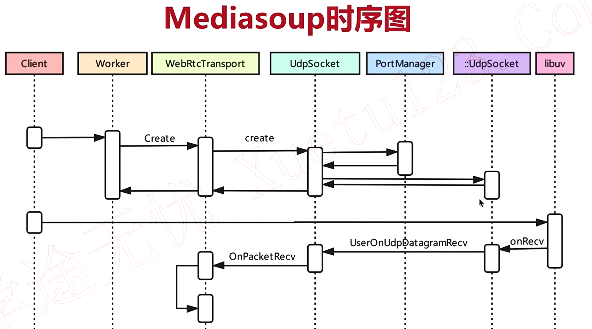
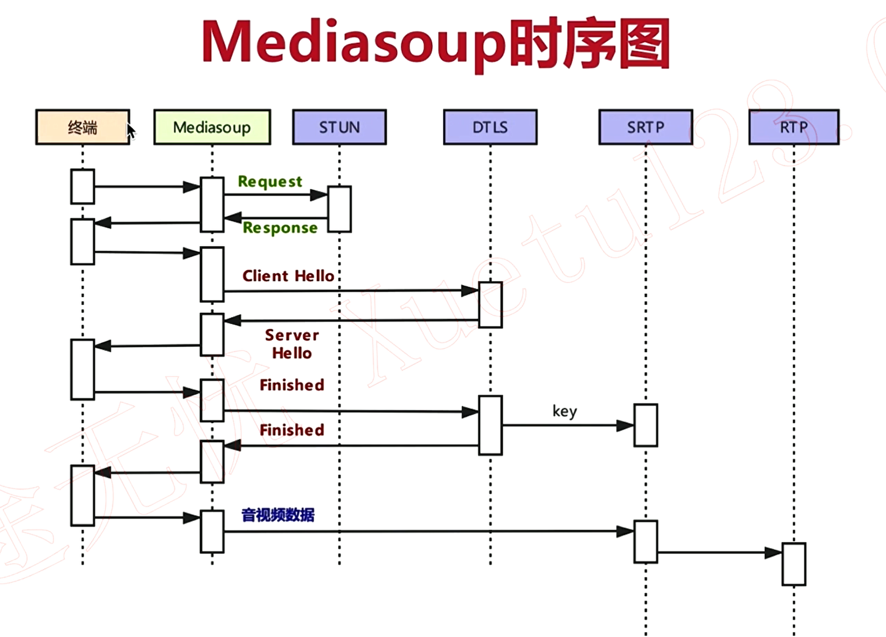

# mediasoup数据传输的函数执行流程
从WebRtcTransport创建到收到数据的函数执行流程如图：

# 认证和加密
在正式传输数据之前，先要向STUN服务器发送binding request来认证用户名密码，然后和dtls四次握手，得到key，使用该key加密srtp，开始传输srtp数据

dtls是非对称加密，srtp是对称加密，webrtc中使用dtls握手来交换用于srtp加密的密钥和加密算法，然后使用srtp来加密音视频数据。

